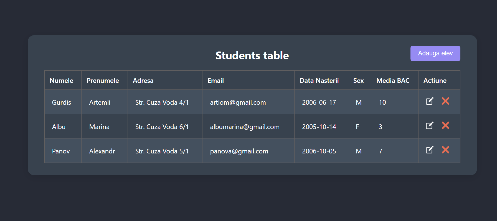
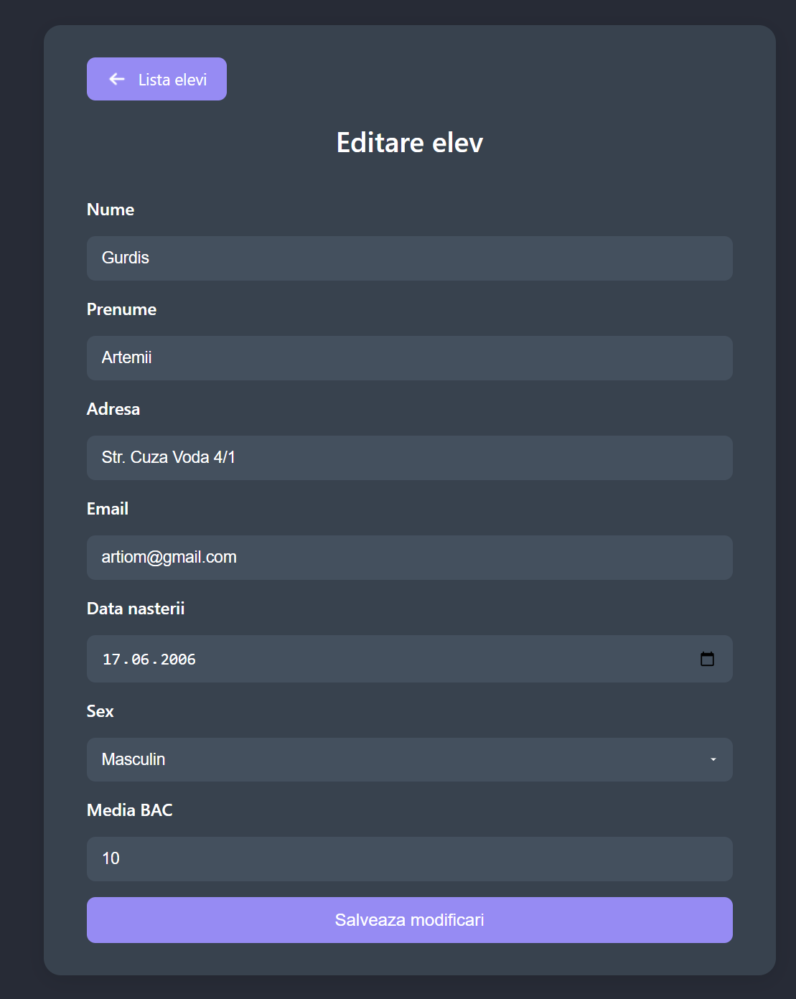
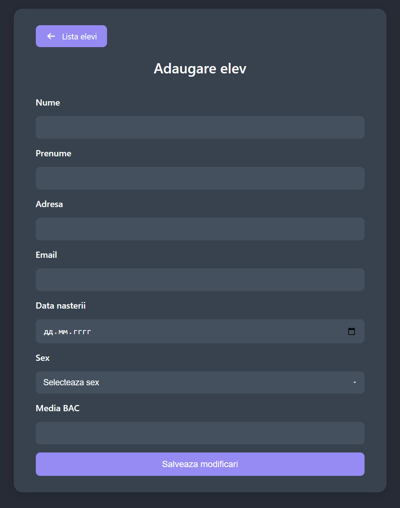

# Student Management System - CRUD Application

A complete web system for managing students with full CRUD operations (Create, Read, Update, Delete).

## 📋 Features

- **View Students** - Complete list of all students
- **Add Student** - Form for adding new students
- **Edit Student** - Modify existing student data
- **Delete Student** - Remove students from the system

## 🛠️ Technologies Used

- **Backend:** PHP
- **Database:** MySQL
- **Frontend:** HTML5, CSS3, JavaScript
- **Server:** Apache

## 🎯 Application Preview

### Main Students List


### Edit Form


### Add Form


## 📁 Project Structure
```
APLICATIE-CRUD/
├── database/
│ └── colegiu.sql
├── images/
│ ├── edit.png
│ ├── clear.png
│ └── left-arrow.png
├── index.php
├── add_elev.php
├── editare.php
├── save_student.php
├── get_data.php
├── redirect_to_edit.php
├── redirect_to_clear.php
├── conection.php
├── student_edit_load.js
├── style.css
└── editStyle.css
```

## 🚀 Installation and Setup

### Prerequisites
- XAMPP or WAMP installed
- PHP 8.2+
- MySQL
- Modern web browser

### 1. Database Setup

#### Import Database via phpMyAdmin:

1. **Open phpMyAdmin:**
http://localhost/phpmyadmin

2. **Create a new database:**
- Name: `colegiu`
- Collation: `utf8_general_ci`

3. **Import the database:**
- Select the `colegiu` database
- Go to the **Import** tab
- Click **Choose File** and select `database/colegiu.sql`
- Click **Go**

### 2. Project Configuration

1. **Place all files in XAMPP htdocs directory:**
C:\xampp\htdocs\APLICATIE-CRUD\

2. **Database connection is configured in `conection.php`**

### 3. Start Application

1. **Start XAMPP services:**
- Open XAMPP Control Panel
- Start Apache and MySQL

2. **Access the application:**
http://localhost/APLICATIE-CRUD/index.php


## 📖 Usage

### 👀 View Students (index.php)
- Main page displays all students in a table
- Shows: Name, Surname, Address, Email, Birth Date, Gender, BAC Average
- Action buttons: Edit and Delete 

### ➕ Add New Student (add_elev.php)
1. Click **"Adauga elev"** button in index.php
2. Fill out all form fields
3. Click **"Salveaza"** to add the new student

### ✏️ Edit Student (editare.php)
1. Click **Edit** icon next to the student
2. Form auto-fills with existing data
3. Modify necessary fields
4. Click **"Salveaza modificari"**

### 🗑️ Delete Student (redirect_to_clear.php)
1. Click **Clear** icon next to the student
2. Student is permanently deleted from database

## 🔧 File Description

### Main Files
- **index.php** - Main student list with CRUD functionality
- **add_elev.php** - Dedicated form for adding new students
- **editare.php** - Form for editing existing students
- **save_student.php** - Processes data saving (CREATE and UPDATE)

### Support Files
- **get_data.php** - Returns student data in JSON format
- **redirect_to_edit.php** - Handles redirect for editing
- **redirect_to_clear.php** - Handles student deletion
- **student_edit_load.js** - JavaScript for dynamic data loading
- **conection.php** - Database connection configuration

### Style Files
- **style.css** - Styles for main page and table
- **editStyle.css** - Styles for add/edit forms

## 🐛 Troubleshooting

### Common Issues

1. **Database connection error**
- Check if MySQL is running
- Verify credentials in `conection.php`

2. **File not found (404)**
- Ensure all files are in correct directory
- Check if Apache is running


---

**Developed as an educational application for learning CRUD operations in PHP and MySQL**
